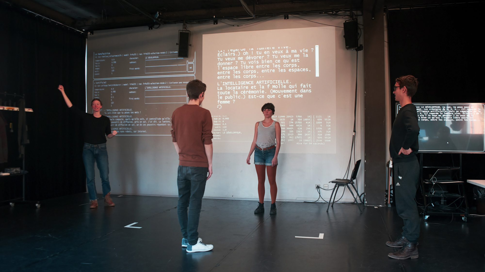

# CHATBOT. Act and dialogue with a conversational agent-actor.

La Manufacture, Lausanne, Switzerland, 2020-2021. [Official project page](https://www.manufacture.ch/fr/4467/CHATBOT-jouer-et-dialoguer-avec-un-agent-conversationnel-acteur)


*Elsa Thébault, Guillaume Ceppi, Lisa Veyrier and Lucas Savioz in rehearsal, La Manufacture, 2020.*

### Abstract

A conversational agent is a computer program resulting from advances in artificial intelligence (AI), which aims to mimic human dialogue interactions. Theatre has made little use of this tool, even though, historically, it has been a practice centred on uttering text. On the basis of this observation, the research team directed by Nicolas Zlatoff at La Manufacture (Haute École des Arts de la Scène) is dedicated precisely to the design, development and staging of a conversational agent on the model of an actor or an actress who would improvise from a text, as he or she usually does in rehearsals.

The team uses a tried-and-tested theatrical technique, originating in the method of one of the most important pedagogues in the history of 20th century theatre, Constantin Stanislavsky, known as action analysis. It allows the actor or actress to improvise and recompose a theatrical text that he or she does not yet know by heart. Using his or her partial knowledge of the text, he or she performs it in fragments, sometimes in his or her own words. A group of acting graduates from La Manufacture will work on this practice with computer scientists who will in turn model it and gradually develop a conversational agent-actor able to engage in a dialogue in writing as well as orally with a human partner on stage.

This transdisciplinary collaboration intends to shift the perception paradigm of an AI, using the acting tools specific to theatre practitioners, and will explore the tension created by the coexistence on stage of a living and an artificial presence.

### Team

Nicolas Zlatoff, stage director (main researcher)  

Prune Beuchat, actress  
Guillaume Ceppi, actor (Manufacture graduate 2019)  
Claire de Ribaupierre, dramaturge  
Prof. Clément Hongler, mathematician and AI researcher  
Marc Riner, IT designer  
Lucas Savioz, actor (Manufacture graduate 2018)  
Batrek Sozanski, actor, assistant HES  
Elsa Thébault, actress (Manufacture graduate 2019)  
Lisa Veyrier, actress (Manufacture graduate 2016), HES assistant  
Jérémie Wenger, writer and programmer  

### Usage

This repo has been created in order to federate the code base of this project and post it on Zenodo. It consists of three parts:
- the interface (a chatroom powered by a nodeJS server);
- the bot (a Python client harnessing the power of [OpenAI's GPT-2](https://github.com/openai/gpt-2));
- additional archival code used for an intermediary stage of the development (legacy).

In order to fetch the code, either use the following command:

```bash
git clone --recurse-submodules https://github.com/jchwenger/chatbot.manufacture
```

or, after cloning, run:

```bash
git submodule init
git submodule update
```

Each of the repositories can be found individually here:
- the [interface](https://github.com/jchwenger/chatbot.interface);
- the [bot](https://github.com/jchwenger/chatbot.bot);
- the [legacy software](https://github.com/jchwenger/chatbot.legacy).

Instructions for use are to be found in the readme of each repo.
